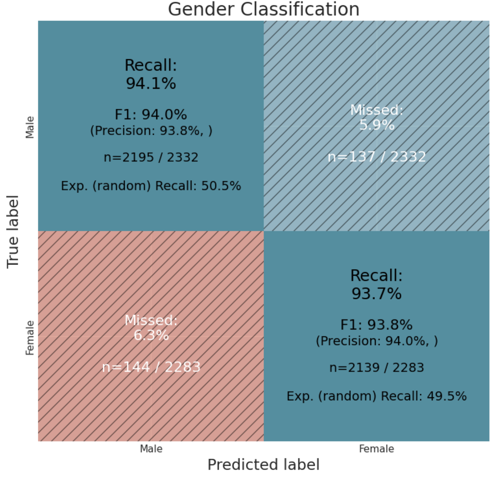
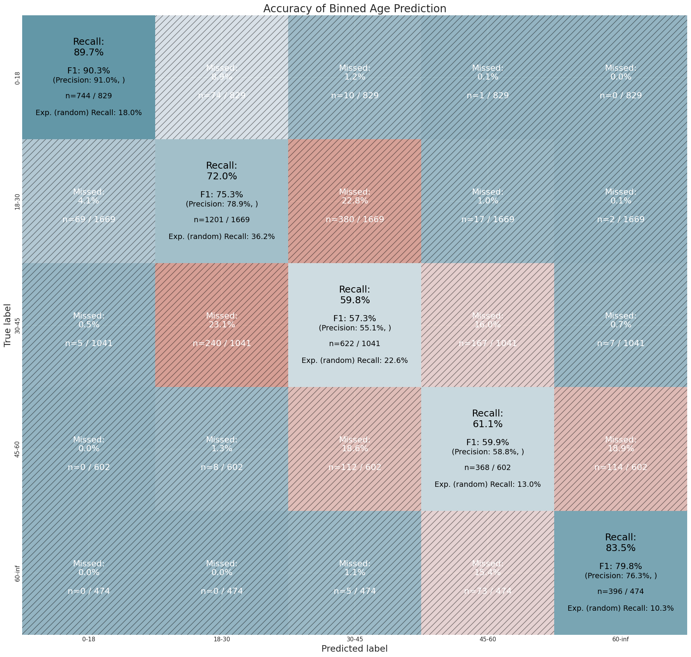
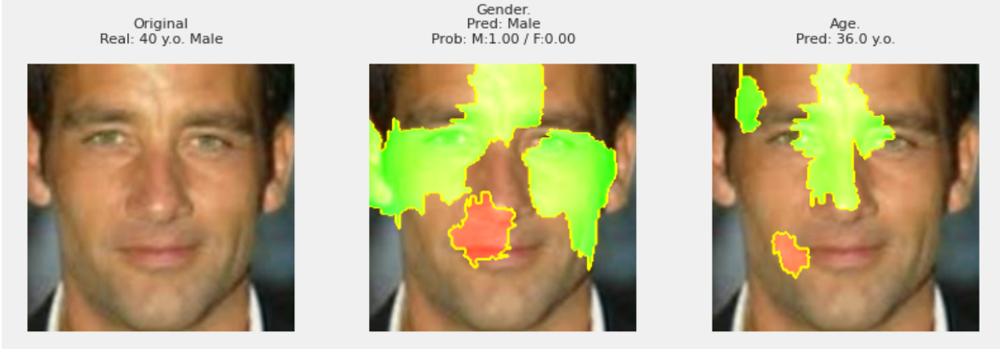

# Age and Gender Prediction with UTK Dataset

## Project Overview

The goal of this project is to build an age and gender classification model trained on
the [UTKFace](https://susanqq.github.io/UTKFace/) dataset.

## Key Highlights

- **MobileNetV3.Small:** Our goal was to use a model with (relatively) simple architecture and small size and
  try to make it competitive with significantly larger and computationally intensive models like VGG or ResNet mainly by
  focusing on optimizing the preprocessing pipeline and the loss function.

- **Training Process:** Extensive hyperparameter tuning and experiment tracking to determine the most robust configuration.

- **Iterative Approach:** We've used an iterative approach by first building a model that was tuned to maximize overall
  gender and age prediction accuracy. After identifying the subsets of the dataset the model performed poorly only (
  underrepresented age groups, specific combinations of gender and skin color etc.) we've augmentation based
  oversampling and tweaked various transformations to reduce biases in our model.
  
- **Evaluation:** Comprehensive evaluation was performed across various splits of the dataset over gender/age prediction
  accuracy over specific age bins, (heuristically estimated) subject skin tones, image quality etc. to identify that
  main weaknesses of our model.

## Performance Overview

Our best-performing models achieved the following results:

| Model                 | notes                               | Gender Acc. | Age MAE     |
|-----------------------|-------------------------------------|-------------|-------------|
| MobileNetV3.Small     | no augmentations                    | 0.921       | 5.335       |
| MobileNetV3.Small     | basic augmentations`2`              | 0.925       | 5.105       |
| **MobileNetV3.Small** | aug. based oversampling`3`          | 0.939       | 4.731       | 
| MobileNetV3.Small     | no weights* + aug. oversampling     | 0.926       | 5.148       |

##### More Details:

2. [v1-Base-Model](https://api.wandb.ai/links/qqwy/murofq6i)

3. [v2-Improved-Model](https://api.wandb.ai/links/qqwy/ndg6x702)

* trained from scratch, others MobileNetV3 small models are using `IMAGENET1K_V1` weights

Compared to selected baseline models*:

| Model                 | notes                  | Gender Acc. | Age MAE | * |
|-----------------------|------------------------|-------------|---------|---|
| XGBoost               | feat. extraction       | 93.80       | 5.89    |   |
| SVC                   | feat. extraction`1`    | 94.64       | 5.49    |   |
| **MobileNetV3.Small** |                        | 0.939       | 4.694   |   |
| VGG_f                 | pre-trained on VGGFace | 0.934       | 4.86    | - |
| ResNet50_f            | (VGGFace2)             | 0.944       | 4.65    |   |
| SENet50_f             | (VGGFace2)             | 0.949       | 4.58    |   |

*Sheoran, V., et al. (2021). Age and Gender Prediction using Deep CNNs and Transfer Learning.
arXiv. https://arxiv.org/pdf/2110.12633

### Performance Summary:

#### Gender Prediction:

#### Age Prediction:

Key findings:
- The model showed consistent performance across most age groups, with some challenges in very young (0-4 years) and very old age ranges.
- Performance was relatively stable across different subject luminance levels (heuristic for skin color), indicating low bias related to skin color.
- Image quality had a noticeable impact on prediction accuracy, with lower quality images generally resulting in reduced performance.
- LIME analysis revealed the facial features most influential in the model's decisions, providing insights into its reasoning process.

### Structure / Table of Contents:

- [1.0_EDA](https://qwyt.github.io/TR_M4_S3_Publish/1.0_EDA.html) ([with code](https://qwyt.github.io/TR_M4_S3_Publish/1.0_EDA_with_code.html))

- [2.0_Preprocessing and Hyperparameter Tuning](https://qwyt.github.io/TR_M4_S3_Publish/2.0_Preprocessing_and_Hyperparameter_Tuning.html) ([with code](https://qwyt.github.io/TR_M4_S3_Publish/2.0_Preprocessing_and_Hyperparameter_Tuning_with_code.html):
    - Overall model structure and component/parameter selection
    - Preprocessing: transformer selection, augmentation and balancing.

- [3.0_Performance_Analysis_and_Improvements](https://qwyt.github.io/TR_M4_S3_Publish/3.0_Performance_Analysis_and_Improvements.html) ([with code](https://qwyt.github.io/TR_M4_S3_Publish/3.0_Performance_Analysis_and_Improvements_with_code.html))
    - Evaluation of the initial model
    - Error analysis
    - Building an improved `v2` model
    - Comparing final and initial model

`(note: please use these links to view the actual notebooks because interactive charts/views will not be visible if opened directly in GitHub)`

##### Source files:

`(most important ones to see:)`

- [src/models/MobileNet/classifier.py](https://github.com/TuringCollegeSubmissions/ppuodz-DL.3.5/blob/master/src/models/MobileNet/classifier.py)
    - Pytorch Lighting Module

- [src/models/MobileNet/data_defs.py](https://github.com/TuringCollegeSubmissions/ppuodz-DL.3.5/blob/master/src/models/MobileNet/data_defs.py)
    - Dataset/Datmodule implementation

- [src/models/MobileNet/metrics.py](https://github.com/TuringCollegeSubmissions/ppuodz-DL.3.5/blob/master/src/models/MobileNet/metrics.py)
    - Main metrics/evaluation functions

- [Individual experiment and Sweep configurations](https://github.com/TuringCollegeSubmissions/ppuodz-DL.3.5/tree/master/config)
    - (might be clearer check the wandb report links for the "production" below to results tables)

## Dataset Summary

The model was trained and fine-tuned using the [UTKFace](https://susanqq.github.io/UTKFace/) dataset, which contains over 20,000 face images with annotations for age, gender.

Dataset split:
- 80% (18,956 images) training set
- 20% (4,740 images) test set

The training set was further split into 80% training and 20% validation during hyperparameter tuning. The final models were  trained on the full training set.

Key characteristics:
- Age range: 0 to 116 years
- Gender: Binary classification (male/female)
- Relaitvley diverse ethnic representation
- Varying image quality and lighting conditions

## Model Architecture

- Base model: MobileNetV3-Small
- Pretrained weights: IMAGENET1K_V1
- Custom classifier layers:
  - Global Average Pooling
  - Two heads with dropout and L1 regularization:
    1. Binary gender classifier
    2. Age regressor
- Optimizer: AdamW
- Learning rate scheduler: OneCycle with Cosine Annealing
- Regularization: L1 regularization and dropout

## Training Pipeline
:
1. Dynamic data augmentation
2. Weighted augmentation-based oversampling
   - Generated additional samples for underrepresented age groups
   - Used intensive transformations to increase data diversity
3. Transfer learning with ImageNet weights
4. One-cycle learning rate scheduling with cosine annealing
   - Achieved faster convergence (15-20 epochs) compared to other schedulers
5. Mixed precision training
6. Batch size: 256
7. Number of epochs: 15-20

## Challenges and Future Improvements

Challenges:
1. Mislabeled or ambiguous samples in the dataset
2. Limited performance on very young age groups (0-4 years)
3. Balancing augmentation to avoid introducing artificial biases

Future improvements:
1. Implement additional preprocessing to exclude invalid or poor-quality images
2. Explore more sophisticated augmentation techniques for underrepresented groups
3. Investigate the use of a continuous scale for gender prediction instead of binary classification
4. Develop separate models or ensemble methods for challenging age groups
5. Incorporate additional datasets to improve diversity and reduce biases

## Ethical Considerations

1. Potential bias in predictions:
   - The model may exhibit varying performance across different ethnic groups or age ranges due to dataset imbalances.
   - Continuous monitoring and adjustment are necessary to ensure fair performance across all demographics.

2. Privacy concerns:
   - Facial image processing raises important privacy issues, especially when dealing with personal data.
   - Strict data handling and anonymization protocols should be implemented in any real-world application.

3. Potential for misuse:
   - Age and gender classification models could be misused for surveillance or discriminatory purposes.
   - Clear guidelines and restrictions on the model's use should be established to prevent unethical applications.

4. Limitations of binary gender classification:
   - The current model uses binary gender classification, which may not accurately represent the full spectrum of gender identities.
   - Future work should explore more inclusive approaches to gender classification or consider whether gender prediction is necessary for the intended application.

5. Transparency and explainability:
   - The decision-making process of deep learning models can be opaque, raising concerns about accountability.
   - Efforts should be made to improve model interpretability and provide clear explanations of predictions when possible.

